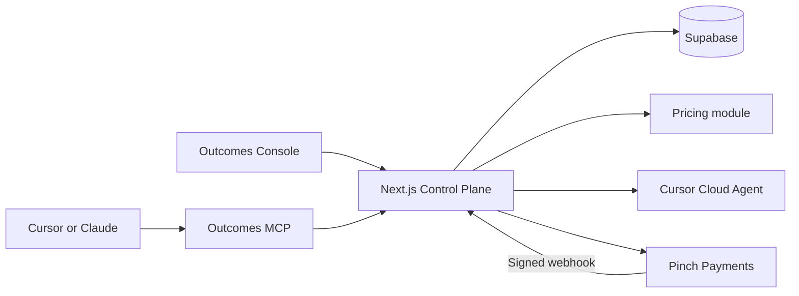

# Outcomes implementation plan

Last updated: 26 July 2026

## Purpose

This document is the durable reference for evolving the existing Outcomes landing page into the Outcomes Control Plane and customer-facing Outcomes Console.

It records:

- the agreed architecture;
- the immediate authentication and console work;
- the larger product roadmap;
- security and landing-page protection requirements;
- decisions that should remain consistent across implementation sessions.

## Product summary

Outcomes gives customers a fixed price for agent work before execution begins.

> Predictable prices for agent work.

> Price the task, not the tokens.

The platform quotes a bounded task, coordinates execution, verifies the result, and controls payment according to an auditable outcome contract.

## Source material

- `prompting-materials/project-summary.md`
- `prompting-materials/site-prompt-refinement.md`
- `prompting-materials/hackathon-presentation-scipt-notes.md`
- [PayTasks system-design discussion](https://chatgpt.com/share/6a6551ae-a208-83ec-aaa3-b11d0632b76f)
- [Next.js, Supabase, and repository discussion](https://chatgpt.com/share/6a65568e-4b60-83ec-b42f-ae8ee600390f)

## Non-negotiable decisions

1. The existing landing page remains the public `/` route.
2. The landing page's design, copy, responsive behavior, and motion should not be unintentionally changed.
3. The landing page and authenticated console live in the same Next.js repository and deployment.
4. Customers sign in with Supabase Auth before accessing the console.
5. The logged-in customer experience is called the **Outcomes Console**.
6. The wider system is the **Outcomes Control Plane**.
7. The MCP is an agent-facing adapter to the control plane, not the source of truth.
8. The browser is a viewer and command surface. It is not responsible for running background work or triggering reliable payment transitions.
9. Supabase stores identity and platform state. Pinch remains the source of truth for payment processing and settlement.
10. Commercial lifecycle changes must be authorized and performed server-side.

## Current repository state

The repository is currently a small Next.js 16 App Router application:

- `/` is implemented by `src/app/page.tsx`;
- the root layout and fonts are in `src/app/layout.tsx`;
- global design tokens are in `src/app/globals.css`;
- the landing page's quote illustration is in `src/components/quote-visual.tsx`;
- there are currently no authentication, database, API, billing, or console dependencies;
- `.env*` files are excluded by `.gitignore`;
- Supabase implementation and Postgres best-practice skills are installed.

This is an expansion of the existing app, not a migration from an existing backend.

## High-level architecture



### Control-plane responsibilities

The Next.js control plane owns:

- public marketing pages;
- signup, sign-in, sign-out, and sessions;
- customer profiles;
- API-key generation, authentication, and revocation;
- immutable quotes and outcome contracts;
- quote acceptance;
- task lifecycle and event history;
- worker orchestration;
- verification results and evidence references;
- payment instructions and locally observed payment state;
- Pinch webhook processing;
- customer-facing console views.

### External-system responsibilities

- **Supabase Auth:** customer identity and sessions.
- **Supabase Postgres:** customer, quote, task, event, and local payment records.
- **Cursor Cloud Agents:** repository work and execution usage.
- **Pinch:** payment method vaulting, attempts, refunds, disputes, and settlement.
- **Outcomes MCP:** agent-friendly tools that call the control-plane API.

## Repository structure

### Immediate structure

The first implementation should avoid moving the landing page. Route groups are added around new functionality only.

```text
src/
├── app/
│   ├── layout.tsx
│   ├── globals.css
│   ├── page.tsx
│   ├── (auth)/
│   │   └── sign-in/
│   │       └── page.tsx
│   ├── (console)/
│   │   └── dashboard/
│   │       ├── layout.tsx
│   │       └── page.tsx
│   └── auth/
│       └── callback/
│           └── route.ts
├── components/
│   ├── quote-visual.tsx
│   ├── auth/
│   └── console/
├── lib/
│   ├── auth/
│   └── supabase/
│       ├── client.ts
│       └── server.ts
└── proxy.ts

supabase/
└── migrations/
```

Route-group names do not appear in URLs:

- `src/app/(auth)/sign-in/page.tsx` becomes `/sign-in`;
- `src/app/(console)/dashboard/page.tsx` becomes `/dashboard`.

In Next.js 16, request interception is implemented with `proxy.ts`, not the older `middleware.ts` convention. Proxy may refresh authentication cookies and perform optimistic redirects, but it must not be the only authorization check.

### Possible later structure

If additional public pages such as `/pricing` or `/docs` are introduced, the landing page can later move into a `(marketing)` route group. That move is not required for authentication or the console and should not be included in the first implementation.

The repository should remain a single Next.js application until a separate runtime, deployment cadence, or operational boundary provides a concrete reason to split it.

## Landing-page protection strategy

The initial authentication work should make one intentional landing-page change:

- add a **Sign in** hyperlink to the existing top navigation.

The following landing-page files should otherwise remain unchanged unless a required integration makes a specific edit necessary:

- `src/app/page.tsx`;
- `src/app/layout.tsx`;
- `src/app/globals.css`;
- `src/components/quote-visual.tsx`.

The existing “Request access” CTA remains intact.

### Sign-in navigation behavior

```text
Visitor clicks Sign in
    -> open /sign-in
    -> check for an authenticated Supabase user
        -> authenticated: redirect to /dashboard
        -> unauthenticated: render the sign-in form
    -> complete authentication
    -> process the auth callback
    -> redirect to /dashboard
```

### Regression checks

Before and after landing-page changes:

1. capture the page at representative desktop and mobile viewport sizes;
2. verify header spacing and navigation wrapping;
3. verify all in-page anchor links;
4. verify the “Request access” action;
5. verify the quote illustration;
6. verify keyboard focus states and the skip link;
7. verify reduced-motion behavior;
8. run lint and a production build.

## Immediate milestone: Supabase Auth and console foundation

### Goal

Deliver a protected but intentionally minimal Outcomes Console without redesigning the landing page.

### Implementation sequence

```text
1. Inspect current Supabase and Next.js documentation.
2. Verify environment-variable names without exposing their values.
3. Install the current recommended Supabase packages and preserve the lockfile.
4. Create browser and server Supabase client utilities.
5. Create proxy.ts for session-cookie refresh and optimistic redirects.
6. Create the authentication callback route.
7. Create the /sign-in page and accessible sign-in form.
8. Make /sign-in redirect authenticated users to /dashboard.
9. Create the protected dashboard layout.
10. Verify the authenticated user again inside the dashboard boundary.
11. Redirect unauthenticated dashboard requests to /sign-in.
12. Create a minimal Outcomes Console home page and sign-out action.
13. Add the Sign in hyperlink to the existing landing-page header.
14. Add an .env.example containing names and placeholders only.
15. Run lint, production build, and authentication checks.
16. Visually compare the landing page before and after the change.
```

### Security rules

- Never expose a Supabase service-role or secret key in browser code.
- Only values deliberately intended for the browser may use a `NEXT_PUBLIC_` prefix.
- Do not use user-editable `user_metadata` for authorization.
- Do not treat a proxy redirect as authorization.
- Verify the user in protected server components, server actions, and route handlers.
- Enable RLS on every exposed application table.
- RLS policies must include row ownership; `TO authenticated` alone is insufficient.
- Use both `USING` and `WITH CHECK` for customer-writable update policies.
- Do not add `SECURITY DEFINER` merely to bypass an RLS problem.

### Acceptance criteria

- `/` remains visually and functionally equivalent except for the new Sign in link.
- An unauthenticated visitor can open `/sign-in`.
- A successful Supabase sign-in redirects to `/dashboard`.
- An authenticated visitor opening `/sign-in` is redirected to `/dashboard`.
- An unauthenticated visitor opening `/dashboard` is redirected to `/sign-in`.
- An authenticated customer can see the console home page.
- The customer can sign out.
- No private Supabase credential is included in browser output.
- Lint and production build pass.

## Broader implementation roadmap

### Phase 1: Authentication and console shell

Deliver the immediate milestone described above.

Console navigation may establish future destinations, but links should only be shown when their destination exists. Do not add non-functional placeholder pages.

### Phase 2: Customer records and API keys

Add:

- a customer profile associated with the Supabase Auth user;
- API-key generation;
- one-time display of the complete key;
- prefix and SHA-256 hash storage;
- key naming, creation time, last-used time, and revocation;
- bearer-key authentication for agent-facing APIs;
- an API Keys console page.

API keys must be separate from Supabase publishable, secret, and service-role keys.

Suggested key format:

```text
ptt_test_<lookup-prefix>_<random-secret>
```

### Phase 3: Quotes and outcome contracts

Implement the first control-plane API:

- receive repository, starting reference, task description, and acceptance criteria;
- determine eligibility;
- calculate predicted cost and customer price;
- persist an immutable, expiring quote;
- return the quote without starting work;
- require explicit acceptance in a separate operation.

Keep these financial values distinct:

- `quoted_price_cents`;
- `predicted_cost_cents`;
- `internal_cost_budget_cents`;
- `actual_cost_cents`;
- `payment_fee_cents`.

### Phase 4: Task execution

After quote acceptance:

1. confirm the quote belongs to the authenticated customer;
2. confirm it is unexpired and unused;
3. confirm the accepted price exactly matches the stored price;
4. confirm the required payment setup exists;
5. create the task and first task event;
6. start the Cursor Cloud Agent run;
7. persist external run identifiers;
8. return a task ID immediately.

The MCP request must not remain open until the worker finishes.

For the hackathon, support one known GitHub repository before attempting general customer GitHub onboarding.

### Phase 5: Status, evidence, and verification

Add:

- worker-status refresh;
- append-only task events;
- execution-usage capture;
- output branch or pull-request references;
- structured evidence;
- a narrow verifier based on agreed acceptance criteria;
- successful and failed terminal paths.

Worker completion is not equivalent to verified completion.

The first verifier should support a narrow, objectively testable task such as:

> Make this failing test pass without modifying the test or public API.

### Phase 6: Pinch onboarding and payment

Implement:

- CaptureJS tokenization;
- reusable Payer and Source references;
- payment-fee calculation;
- deterministic nonces;
- payment creation or scheduling;
- signed webhook verification using the raw request body;
- idempotent webhook processing;
- cancellation where supported;
- refund and reconciliation state.

The platform database is the source of truth for contracts and execution. Pinch is the source of truth for payment processing and settlement.

Do not describe a scheduled payment as escrow.

### Phase 7: MCP interface

Expose three initial tools:

1. `quote_task`
2. `accept_quote_and_start`
3. `get_task_status`

The MCP authenticates with the customer API key and delegates all business rules to the control-plane API.

Do not combine quote, acceptance, execution, and charging into one tool. Quote acceptance is the explicit commercial boundary.

### Phase 8: Console product views

Build customer-facing views for:

- overview;
- tasks;
- task detail and timeline;
- quotes;
- API keys;
- usage and economics;
- billing and payment status;
- account settings;
- “Report a problem.”

“Report a problem” pauses settlement and opens an evidence-based review. It does not let a customer unilaterally erase a charge.

### Phase 9: Hardening

Add:

- organization and role support if required;
- rate limiting;
- audit logs;
- webhook replay protection;
- retry and idempotency policies;
- background jobs or queues where polling no longer suffices;
- test coverage for authentication, RLS, lifecycle transitions, and payments;
- monitoring and operational alerts;
- CI checks;
- GitHub App or OAuth onboarding.

## Initial data model

The likely first application tables are:

### `profiles`

Customer identity and account-level configuration linked to `auth.users`.

### `api_keys`

Key prefix, hash, last four characters, customer ownership, timestamps, and revocation state.

### `quotes`

Immutable task specification, price, predicted cost, budget, acceptance criteria, expiry, and contract hash.

### `tasks`

Current task state, accepted quote, customer ownership, repository reference, worker identifiers, and summary values.

### `task_events`

Append-only task history containing state changes, external events, verification results, and evidence references.

### `payments`

Task, amount, fee, deterministic nonce, Pinch identifiers, and locally observed payment status.

### `webhook_events`

Provider event ID, payload metadata, processing state, and timestamps used for idempotency and auditability.

Schema details and policies must be introduced through reviewed migrations rather than one-off dashboard edits.

## Task state machine

Primary path:

```text
quoted
    -> accepted
    -> running
    -> verifying
    -> review
    -> payment_scheduled
    -> paid
    -> settled
```

Alternative states:

```text
quote_expired
worker_failed
budget_stopped
verification_failed
disputed
payment_failed
refunded
cancelled
```

State transitions must be validated server-side and recorded in `task_events`.

## Hackathon vertical slice

The implementation should optimize for one complete and credible journey:

```text
Sign up
    -> save payment method
    -> generate API key
    -> configure MCP
    -> request a quote
    -> approve the fixed price
    -> start a Cursor Cloud Agent
    -> verify the result
    -> trigger Pinch payment
    -> display evidence, cost, payment, and margin
```

The successful demo path should be built before adding broad dashboard functionality.

## Explicit scope boundaries

Do not introduce these until a concrete requirement justifies them:

- a monorepo conversion;
- a separate marketing deployment;
- a separate console repository;
- general customer GitHub onboarding;
- arbitrary-task guarantees;
- a complex organization/RBAC model;
- a dedicated queue or worker platform when bounded polling is sufficient;
- multiple MCP tools that duplicate the same lifecycle operation;
- speculative abstractions for future providers.

## Open product decisions

These decisions should be resolved before their corresponding phase:

- whether magic-link or social OAuth sign-in should be added after the initial email-and-password flow;
- whether the initial account model is individual-only or organization-first;
- the first objectively verifiable task shape;
- the review window before payment;
- Pinch sandbox behavior and payment timing;
- the exact worker usage-to-cost calculation;
- whether payment is created after verification or scheduled and later cancelled;
- the first supported MCP client;
- dispute and remediation limits.

## Cross-session continuation checklist

At the beginning of each implementation session:

1. read this document;
2. inspect current git status without discarding unrelated changes;
3. identify the active roadmap phase;
4. inspect current Next.js and Supabase documentation relevant to that phase;
5. preserve the landing-page protection requirements;
6. implement only the next complete vertical increment;
7. verify lint, build, security behavior, and affected user flows;
8. update this document when an architectural decision changes.

## Expected mature repository structure

The landing page should eventually move from `src/app/page.tsx` to `src/app/(marketing)/page.tsx`. This is an intentional later organizational change, not part of the initial authentication work. It does not change the public URL: the landing page will remain `/`.

Make this move after the authentication and console foundation is stable, or when a second public route such as `/pricing` or `/docs` creates a concrete need for a shared marketing layout. Move the page rather than copy it so that two files never resolve to `/`.

```text
src/
├── app/
│   ├── layout.tsx
│   ├── globals.css
│   ├── (marketing)/
│   │   ├── layout.tsx
│   │   ├── page.tsx
│   │   ├── pricing/
│   │   │   └── page.tsx
│   │   └── docs/
│   │       └── page.tsx
│   ├── (auth)/
│   │   └── sign-in/
│   │       └── page.tsx
│   ├── (console)/
│   │   └── dashboard/
│   │       ├── layout.tsx
│   │       ├── page.tsx
│   │       ├── tasks/
│   │       ├── api-keys/
│   │       ├── billing/
│   │       └── settings/
│   ├── api/
│   │   ├── v1/
│   │   │   ├── quotes/
│   │   │   └── tasks/
│   │   ├── mcp/
│   │   └── webhooks/
│   │       └── pinch/
│   └── auth/
│       └── callback/
│           └── route.ts
├── components/
│   ├── marketing/
│   ├── auth/
│   └── console/
├── lib/
│   ├── auth/
│   ├── supabase/
│   ├── api-keys/
│   ├── pricing/
│   ├── tasks/
│   ├── workers/
│   └── billing/
└── proxy.ts

supabase/
└── migrations/
```

The route groups separate presentation concerns while preserving one application, one domain, and one deployment.

## Implementation status

### Phase 1: Authentication and console shell

Status on 26 July 2026: **implementation complete; core real-account flow
verified**.

Implemented:

- current `@supabase/ssr` and `@supabase/supabase-js` dependencies;
- request-scoped browser and server Supabase clients;
- Next.js 16 `proxy.ts` session refresh scoped to auth and console routes;
- server-verified dashboard authorization using `getClaims()`;
- email-and-password sign-in and account creation;
- PKCE auth callback with safe relative redirects;
- authenticated sign-out;
- `/sign-in` and protected `/dashboard` routes;
- a dark Outcomes Console visual system using the existing fonts, cobalt accent, square geometry, and ledger language;
- a Sign in link in the existing landing-page header;
- `.env.example` with placeholders only.

Verified:

- lint passes;
- the production build passes;
- `/` remains statically rendered;
- the landing page was visually checked at desktop and mobile sizes;
- an unauthenticated `/dashboard` request redirects to `/sign-in`;
- the configured Supabase project responds correctly to rejected credentials;
- form errors are exposed as accessible alerts;
- real account creation triggered a Supabase confirmation email;
- successful sign-in established a session and redirected to `/dashboard`;
- the authenticated dashboard rendered successfully without JavaScript or
  authentication errors.

Remaining verification:

- observe signup and the confirmation callback as one continuous browser trace;
- verify authenticated sign-out;
- verify that `/dashboard` redirects to `/sign-in` after sign-out.

## Next action

Complete the remaining sign-out smoke check, then begin **Phase 2: Customer
records and API keys**.
