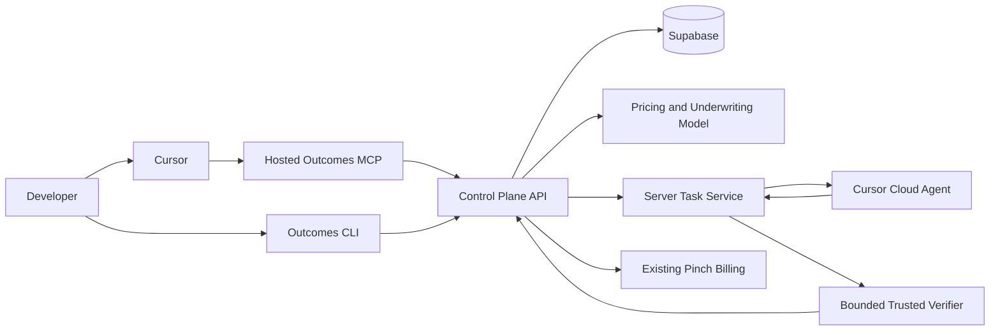
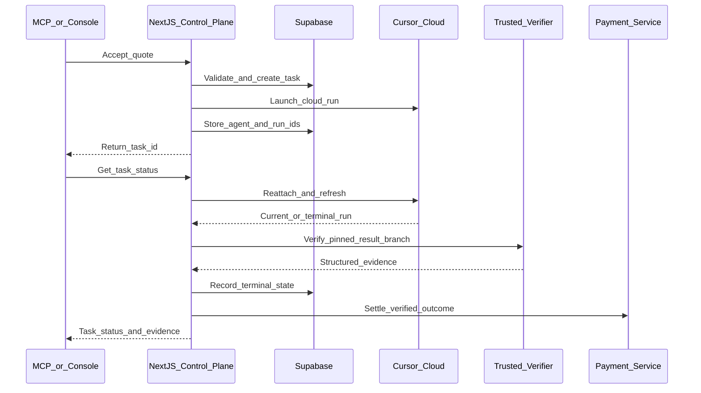

# Outcomes Control Plane Integration

## Architecture decision

Use a hosted control-plane API as the product core. MCP is the primary agent-facing adapter; a CLI is a second adapter over the same API. A skill may teach agents how to formulate bounded work and call the tools, but it must not contain business logic, credentials, pricing state, or billing authority.

Keep the entire working prototype in the existing Next.js application on Vercel, with Supabase for state and Cursor Cloud for agent execution. Do not add Modal or a new workflow/queue platform to today's implementation. The prototype supports one known, trusted GitHub repository, explicit status polling, and a bounded verifier; additional execution infrastructure is a later hardening decision only when arbitrary customer repositories, unattended completion, or customer-controlled commands are introduced.

The existing plan’s boundary is correct: MCP delegates to the control plane and is never the source of truth. Keep the three initial tools in [OUTCOMES_IMPLEMENTATION_PLAN.md](/Users/williamryan/PROJECTS/llms-by-the-outcome/OUTCOMES_IMPLEMENTATION_PLAN.md): `quote_task`, `accept_quote_and_start`, and `get_task_status`.

## Map the prototype into the control plane

- Port the pure, reusable pricing kernel from [domain.ts](/Users/williamryan/PROJECTS/llms-by-the-outcome/build-attempt-1/src/domain.ts), [task-analysis.ts](/Users/williamryan/PROJECTS/llms-by-the-outcome/build-attempt-1/src/task-analysis.ts), [estimator.ts](/Users/williamryan/PROJECTS/llms-by-the-outcome/build-attempt-1/src/estimator.ts), and `rate-card.ts` into the other app’s server-only `src/lib/pricing/` modules, preserving Zod validation and tests.
- Evolve that kernel into one pricing and underwriting model with two output views. Its private output contains predicted execution and verification costs, cost distribution, success probability, risk allowance, internal budget, and expected margin. Its public output contains the fixed customer quote, scope, conditions, expiry, and contract hash without exposing the internal cost basis.
- Persist the complete immutable pricing decision with distinct `quoted_price_cents`, `predicted_cost_cents`, `internal_cost_budget_cents`, payment fees, expiry, estimator/policy versions, repository SHA, and contract hash. Only the customer-safe projection is returned by the quote API.
- Calculate the quote from risk-adjusted expected delivery cost plus the target margin and any passed-through fees. The spread over predicted cost is expected gross profit at quote time; realized gross profit is only known after actual execution, verification, payment, remediation, and refund costs are recorded.
- Adapt [runner.ts](/Users/williamryan/PROJECTS/llms-by-the-outcome/build-attempt-1/src/runner.ts) into `src/lib/workers/cursor/`. The backend uses the Outcomes-owned Cursor service credential; the customer-facing Outcomes API key only identifies and authorizes the customer.
- Replace [ledger.ts](/Users/williamryan/PROJECTS/llms-by-the-outcome/build-attempt-1/src/ledger.ts) JSONL storage with Supabase `quotes`, `tasks`, and append-only `task_events`. Retain the JSONL harness in this repository for benchmarking and estimator calibration.
- Split [workflow.ts](/Users/williamryan/PROJECTS/llms-by-the-outcome/build-attempt-1/src/workflow.ts) into durable transitions: start the cloud run and return a task ID immediately; refresh/poll worker status separately; verify separately; then invoke the existing payment flow.
- Enforce the estimator decision before acceptance or execution. The spike currently permits `decompose` and `decline` estimates to run; the control plane must only create a guaranteed-outcome task from an eligible, accepted quote.

## Canonical API and adapters

- Implement server-side quote and task operations once, then call them from REST route handlers and MCP tools. MCP tool handlers must not duplicate pricing, ownership, quote-expiry, state-transition, or charging rules.
- Make acceptance a separate billable boundary. `accept_quote_and_start` should take `quote_id`, `contract_hash` or expected price, and an idempotency key; the server loads the authoritative amount and rejects expired, changed, reused, or foreign quotes.
- Keep MCP execution asynchronous by returning `task_id` and a status URL/result. Use `get_task_status` polling for the MVP rather than depending on the not-yet-universally-supported MCP Tasks extension.
- Build the CLI later as `outcomes quote`, `outcomes run`, and `outcomes status` over the same HTTP client. If local-repository inspection becomes necessary, the package can also expose an `outcomes mcp` stdio mode, but the GitHub-first MVP should use the hosted MCP directly.

## Repository and runtime boundary

- For the first vertical slice, accept only a configured GitHub repository plus an exact commit SHA, matching the scope already recorded in the implementation plan. A remote MCP cannot safely infer or read an arbitrary local checkout by itself.
- Do not run the current clone/scan/wait workflow inside a long-lived Vercel request. Launch Cursor Cloud, persist `agent_id` and `run_id`, and return the Outcomes `task_id` immediately.
- Cursor Cloud supplies the execution VM and persists cloud runs. Implement `get_task_status` so it reattaches with `Agent.getRun`, refreshes Supabase state and usage, and performs the bounded terminal verification when needed. This request-driven polling is sufficient for today's prototype.
- Use bounded GitHub API preflight inside Vercel for the known prototype repository. Avoid a general-purpose clone-and-execute service in today's scope.
- Verify the known result branch with a fixed, server-owned verifier or a repository CI check. Do not accept customer-supplied commands. If a fully independent verifier cannot be completed today, record that limitation explicitly rather than adding a second compute platform.
- Do not expose the current free-form `verifierCommand` from [domain.ts](/Users/williamryan/PROJECTS/llms-by-the-outcome/build-attempt-1/src/domain.ts) to customers. Replace it with server-selected verifier profiles or a strict allowlist executed without customer credentials.
- Canonicalize repository identities before matching Cursor branch results. Existing records may return `github.com/owner/repo` while the manifest stores `https://github.com/owner/repo`, which can otherwise skip cloud verification.
- Preserve the prototype’s observed caveats: cloud hooks are not inherited by arbitrary repositories, token/cost cancellation can overshoot, and a finished worker is not a verified outcome.

## Deployment topology

For today's prototype, the verifier is constrained to the known repository, fixed test command, and pinned result branch. General customer-controlled repository execution is explicitly out of scope.

## Handoff package for the main repository

Give the implementing agent:

1. This plan and [OUTCOMES_IMPLEMENTATION_PLAN.md](/Users/williamryan/PROJECTS/llms-by-the-outcome/OUTCOMES_IMPLEMENTATION_PLAN.md).
2. The prototype source files [domain.ts](/Users/williamryan/PROJECTS/llms-by-the-outcome/build-attempt-1/src/domain.ts), [task-analysis.ts](/Users/williamryan/PROJECTS/llms-by-the-outcome/build-attempt-1/src/task-analysis.ts), [estimator.ts](/Users/williamryan/PROJECTS/llms-by-the-outcome/build-attempt-1/src/estimator.ts), [rate-card.ts](/Users/williamryan/PROJECTS/llms-by-the-outcome/build-attempt-1/src/rate-card.ts), [runner.ts](/Users/williamryan/PROJECTS/llms-by-the-outcome/build-attempt-1/src/runner.ts), [workflow.ts](/Users/williamryan/PROJECTS/llms-by-the-outcome/build-attempt-1/src/workflow.ts), and [repository.ts](/Users/williamryan/PROJECTS/llms-by-the-outcome/build-attempt-1/src/repository.ts).
3. The regression baseline in [core.test.ts](/Users/williamryan/PROJECTS/llms-by-the-outcome/build-attempt-1/tests/core.test.ts), the fixture task/repository, and the versioned rate card.
4. The benchmark ledger only as calibration/reference data, not as production persistence.

Do not copy `node_modules/`, `dist/`, generated reports, or the CLI orchestration wholesale into the deployed app. Port the pure modules behind server-only interfaces, replace filesystem assumptions, and preserve the prototype repository as a benchmark laboratory.

Required secret names should be documented with placeholders only: the Outcomes/Supabase server credentials already used by the main app, an Outcomes-owned Cursor API key, GitHub repository access, and payment credentials.

## Delivery order

1. Complete the other app’s customer/API-key phase and establish shared authenticated REST helpers.
2. Port the pricing kernel, add private underwriting and public quote projections, and create immutable quote persistence plus `POST /api/v1/quotes`.
3. Add explicit quote acceptance and task creation with idempotent server-side transitions.
4. Adapt the Cursor cloud runner to launch asynchronously, persist agent/run IDs, return immediately, and reconcile status and usage from `get_task_status`.
5. Add the bounded trusted-repository verifier, structured evidence, and terminal task events.
6. Connect verified terminal states to the already-planned payment lifecycle.
7. Add the hosted Streamable HTTP MCP route as a thin adapter exposing the three tools.
8. Add a CLI only after the HTTP contract stabilizes; optionally add a small agent skill for task-shaping guidance and installation instructions.

## Verification

- Unit-test schema validation, eligibility enforcement, customer-price derivation, contract hashing, ownership, expiry, idempotency, repository URL normalization, and state transitions.
- Integration-test Outcomes API-key authentication, quote-to-task linkage, immediate task response, repeated status polling, Cursor run reconciliation, bounded verifier pass/fail paths, and idempotent payment instruction.
- Demonstrate both outcomes against the pinned fixture: verified success triggers settlement; worker or verifier failure does not charge the customer.
